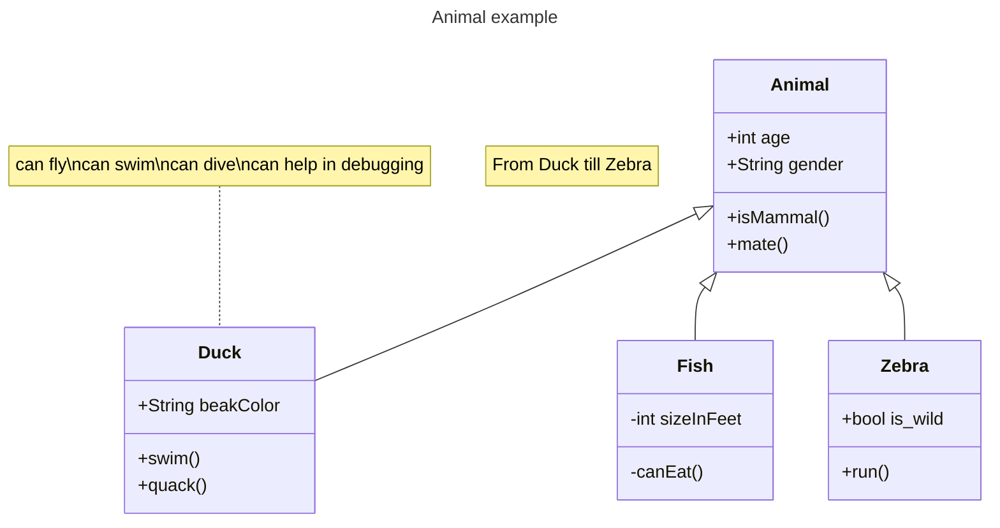

Recently, I migrated my personal site from Hugo to Jekyll and I was satisfied to make this change. My website seems to be silent for roughly 3 years after I entered Pinduoduo. It is the right time to bring my person page back to the earth as well as my writing habit.

[Jekyll](https://jekyllrb.com/){:target="\_blank"} is a powerful static websites and blogs generator. It takes text written in your favorite markup language and uses layouts to create a static website. You can tweak the site’s look and feel, URLs, the data displayed on the page, and more. Since I am not really familiar with all the features Jekyll has provided to write a nice post, I will summarize some common usage in this blog.

## 1. How to use Jekyll ?

**Prerequisites**

- Ruby version **2.5.0** or higher
- RubyGems
- GCC and Make

**Use Jekyll locally**

1. Install all [prerequisites](https://jekyllrb.com/docs/installation/).

2. Install the jekyll and bundler

   ```bash
   gem install jekyll bundler
   ```

3. Install `mermaid-cli`

   ```bash
   npm install -g @mermaid-js/mermaid-cli
   ```
   If we cannot install chromium, we can ignore it.
   ```bash
   PUPPETEER_SKIP_DOWNLOAD=1 npm install -g @mermaid-js/mermaid-cli
   ```
4. Serve in local environment.
   ```bash
   bundle exec jekyll serve --host 0.0.0.0
   ```

5. Browse to [http://127.0.0.1:4000](http://127.0.0.1:4000/)

Now, we could visit and preview our blog locally before pushing contents to github pages.

## 2. How blogging work with Jekyll?

You might be wondering how you can have a blog without a database. In true Jekyll style, blogging is powered by text files only.

### Post header

All blog posts live in a folder called `posts`. Jekyll is responsible for transforming text file into rich text web pages without the help of a database. If we want to create a post from scratch, we need one file in a special name format: `YYYY-mm-dd-name.md`. The date and `name` part will form up a permanent link to this post.

Following header content:

```markdown
---
layout: post
title: the title we include in the main page
date: 2023-02-08 15:58:00
description: description showing in the preview mode
tags: tags we want to attach.
categories: categories we want to use.
---
```

Now, we could proceed our content of this post.

We can write markdown scripts directly, but we still need to use the power of [Liquid templating language](https://jekyllrb.com/docs/step-by-step/02-liquid/){:target="\_blank"} sometimes. For example, if we want to open an link in another tab, we need to append `{:target="_blank"}` at the end of a hyperlink `[description](http://link.com)`. We can also click the default [cv link](/cv) without opening a new tab.

## 3. HTML Support

We can take full advantage of html with markdown. Here are some example to use html elements:

- `<ul>` and `<li>`

  **source:**

  ```html
  <ul>
    <li>brunch</li>
    <li>fixie</li>
    <li>raybans</li>
    <li>messenger bag</li>
  </ul>
  ```

  **display:**

  <ul>
      <li>brunch</li>
      <li>fixie</li>
      <li>raybans</li>
      <li>messenger bag</li>
  </ul>

- `<a href="">`

  **source:**

  ```
  <a href="https://github.com">Github</a>
  ```

  **display:**

  <a href="https://github.com">Github</a>

- `<hr>` Separator

  **source:// or mermaid-cli**

  ```html
  <hr />
  ```

  **display:**

  <hr>

- `<blockquote>` for quote

  **source:**

  ```html
  <blockquote>
    We do not grow absolutely, chronologically. We grow sometimes in one
    dimension, and not in another, unevenly. We grow partially. We are relative.
    We are mature in one realm, childish in another. —Anais Nin
  </blockquote>
  ```

  **display:**

<blockquote>
    We do not grow absolutely, chronologically. We grow sometimes in one dimension, and not in another, unevenly. We grow partially. We are relative. We are mature in one realm, childish in another.
    —Anais Nin
</blockquote>

### HTML Formatting

- `<b>` - <b>Bold text</b>
- `<strong>` - <strong>Important text</strong>
- `<i>` - <i>Italic text</i>
- `<em>` - <em>Emphasized text</em>
- `<mark>` - <mark>Marked text</mark>
- `<small>` - <small>Smaller text</small>
- `<del>` - <del>Deleted text</del>
- `<ins>` - Here are <ins>Inserted text</ins> between normal text.
- `<sub>` - Here is<sub>Subscript text</sub>
- `<sup>` - Here is<sup>Superscript text</sup>
- `<u>` - <u>Underline text</u>

### Text Size

**We can also set text size with attribute `style`.**

1. normal mode.

   ```html
   <p style="font-size:70px">Hello World</p>
   ```

   <p style="font-size:70px">Hello World

2. Responsive size.

   ```html
   <h1 style="font-size:10vw">Hello World</h1>
   ```

   <h1 style="font-size:10vw">Hello World</h1>

   It's responsive font size. The text size can be set with a `vw` unit, which means the "viewpoint width". If we resize the browser, the font size scales to the same viewpoint width.

   > Viewport is the browser window size. 1vw = 1% of viewport width. If the viewport is 50cm wide, 1vw is 0.5cm.

## 4. Math

With the support of [MathJax 3](https://www.mathjax.org/) engine, out post can render beautiful math inline and display mode. We just need to surround math expressions with <strong>\$\$</strong> , like `$$ E = mc^2 $$`. If we leave it inside a paragraph, it will produce an inline expression, just like $$E = mc^2$$.

- **Display mode**: place `$$` as a separate paragraph

$$
\sum_{k=1}^\infty |\langle x, e_k \rangle|^2 \leq \|x\|^2
$$

- **MathJax mode**: use `\begin{equation}...\end{equation}` ; add `\label{...}` inside the equation environment, we can now refer to the equation using `\eqref`.

```latex
\begin{equation}
\label{eq:cauchy-schwarz}
\left( \sum_{k=1}^n a_k b_k \right)^2 \leq \left( \sum_{k=1}^n a_k^2 \right) \left( \sum_{k=1}^n b_k^2 \right)
\end{equation}
```


\begin{equation}
\label{eq:cauchy-schwarz}
\left( \sum_{k=1}^n a_k b_k \right)^2 \leq \left( \sum_{k=1}^n a_k^2 \right) \left( \sum_{k=1}^n b_k^2 \right)
\end{equation}

We need to refer to the equation above:


```latex
\begin{align}
x& = y_1-y_2+y_3-y_5+y_8-\dots
&& \text{by \eqref{eq:cauchy-schwarz}}\\
& = y'\circ y^* && \text{(by \eqref{eq:cauchy-schwarz})}\\
& = y(0) y' && \text {by Axiom 1.}
\end{align}
```


\begin{align}
x& = y_1-y_2+y_3-y_5+y_8-\dots
&& \text{by \eqref{eq:cauchy-schwarz}} \\
& = y'\circ y^\* && \text{(by \eqref{eq:cauchy-schwarz})} \\
& = y(0) y' && \text {by Axiom 1.}
\end{align}

Note that MathJax 3 is [a major re-write of MathJax](https://docs.mathjax.org/en/latest/upgrading/whats-new-3.0.html) that brought a significant improvement to the loading and rendering speed, which is now [on par with KaTeX](http://www.intmath.com/cg5/katex-mathjax-comparison.php).

## 5. Code highlight

We can use a liquid tag to highlight our code:

<hr>
 <br>
code code code<br>
 

<hr>


int main(int argc, char const \*argv[]) {
string myString;

    cout << "input a string: ";
    getline(cin, myString);
    int length = myString.length();
    
    char charArray = new char * [length];
    
    charArray = myString;
    for(int i = 0; i < length; ++i){
        cout << charArray[i] << " ";
    }
    
    return 0;

}


**Rust code:**



#![crate_name = "doc"]

/// A human being is represented here
pub struct Person {
/// A person must have a name, no matter how much Juliet may hate it
name: String,
}

impl Person {
/// Returns a person with the name given them
///
/// # Arguments
///
/// \* `name` - A string slice that holds the name of the person
///
/// # Examples
///
/// `` /// // You can have rust code between fences inside the comments /// // If you pass --test to `rustdoc`, it will even test it for you! /// use doc::Person; /// let person = Person::new("name"); ///``
pub fn new(name: &str) -> Person {
Person {
name: name.to_string(),
}
}

    /// Gives a friendly hello!
    ///
    /// Says "Hello, [name](Person::name)" to the `Person` it is called on.
    pub fn hello(& self) {
        println!("Hello, {}!", self.name);
    }

}

fn main() {
let john = Person::new("John");

    john.hello();

}



## 6. Images layout

We can use different layout to form a group of images, here are some exmaples.

:arrow_right_hook: **Images in the same row with a caption.**



```html
<div class="row mt-3">
       <div class="col-sm mt-3 mt-md-0">
           
       </div>
       <div class="col-sm mt-3 mt-md-0">
           
       </div>
   </div>
   <div class="caption">
       A simple, elegant caption looks good between image rows, after each row, or doesn't have to be there at all.
</div>
```



<div class="row mt-3">
       <div class="col-sm mt-3 mt-md-0">
           
       </div>
       <div class="col-sm mt-3 mt-md-0">
           
       </div>
   </div>
   <div class="caption">
       A simple, elegant caption looks good between image rows, after each row, or doesn't have to be there at all.
</div>
:arrow_right_hook: **Images can be zoomable. Simply add `data-zoomable` to `` tags that you want to make zoomable.**



```html
<div class="row mt-3">
       <div class="col-sm mt-3 mt-md-0">
           
       </div>
       <div class="col-sm mt-3 mt-md-0">
           
       </div>
</div>
```



<div class="row mt-3">
       <div class="col-sm mt-3 mt-md-0">
           
       </div>
       <div class="col-sm mt-3 mt-md-0">
           
       </div>
</div>
:arrow_right_hook: **Images are arranged into different mini-galleries.**



```html
<div class="row mt-3">
       <div class="col-sm mt-3 mt-md-0">
           
       </div>
       <div class="col-sm mt-3 mt-md-0">
           
       </div>
       <div class="col-sm mt-3 mt-md-0">
           
       </div>
</div>
```



<div class="row mt-3">
       <div class="col-sm mt-3 mt-md-0">
           
       </div>
       <div class="col-sm mt-3 mt-md-0">
           
       </div>
       <div class="col-sm mt-3 mt-md-0">
           
       </div>
</div>


## 7. Diagrams

We can generate great diagrams using [jekyll-diagrams](https://github.com/zhustec/jekyll-diagrams){:target="\_blank"} plugin. We can use different languages such as [mermaid](https://mermaid-js.github.io/mermaid/){:target="\_blank"}, [plantuml](https://plantuml.com/){:target="\_blank"}, [vega-lite](https://vega.github.io/vega-lite/){:target="\_blank"}, etc. 

We prepared mermaid-cli before, so here are examples showing how to use mermaid.

### Mermaid

**Sequence Diagram**



```
>
sequenceDiagram
    participant John
    participant Alice
    Alice->>John: Hello John, how are you?
    John-->>Alice: Great!

```



>
sequenceDiagram
participant John
participant Alice
Alice->>John: Hello John, how are you?
John-->>Alice: Great!


**flowchart**



```
flowchart TD
    A[Start] --> B{Is it?}
    B -- Yes --> C[OK]
    C --> D[Rethink]
    D --> B
    B -- No ----> E[End]
```



>
flowchart TD
A[Start] --> B{Is it?}
B -- Yes --> C[OK]
C --> D[Rethink]
D --> B
B -- No ----> E[End]


**Class Diagrams**








>

---
title: Animal example
---
classDiagram
    note "From Duck till Zebra"
    Animal <|-- Duck
    note for Duck "can fly\ncan swim\ncan dive\ncan help in debugging"
    Animal <|-- Fish
    Animal <|-- Zebra
    Animal : +int age
    Animal : +String gender
    Animal: +isMammal()
    Animal: +mate()
    class Duck{
        +String beakColor
        +swim()
        +quack()
    }
    class Fish{
        -int sizeInFeet
        -canEat()
    }
    class Zebra{
        +bool is_wild
        +run()
    }


